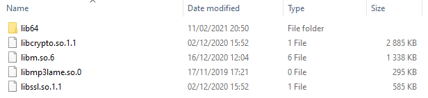
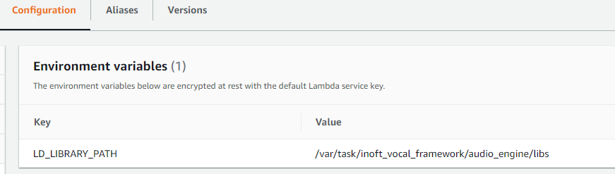

## Building on and for Windows :

*Tested and working on Windows 10*

### Pre-requirements :

#### Installations :

Install Rust according to instructions (will auto-detect and give matching instructions according to the operating system) : https://www.rust-lang.org/tools/install

#### Building Lame :

todo


### Building

#### Navigate to the root audio_engine folder

`cd .../inoft_vocal_framework/audio_engine/`

#### Run the cargo build 

`cargo build --release --features $python-version`

Where $python-version can be :

- python39
- python38

An `audio_file.dll` file will be generated in `.../inoft_vocal_framework/audio_engine/target/release` folder. Copy it to `.../inoft_vocal_framework/audio_engine` and rename the file from `audio_engine.dll` to `audio_engine.pyd`, which will allows Python to read the file.


## Consuming :

### AWS Lambda :

AWS Lambda runs on Linux. If you try to use a version of the framework that has been build for Windows, but not for Linux, you will get the error `Module not found`, because when running the `import audio_engine` line in Python running on Linux, it will not look for `audio_engine.pyd` like it would on Windows, but it will look for `audio_engine.so`

Please follow the instructions on how to build on Linux. 


---


## Building on and for Linux :

*Tested and working on :*

- *Ubuntu 20.04.2 desktop amd64 in a virtual linux machine running in VirtualBox 5.2.12 :*
  - *Ubuntu download : https://ubuntu.com/download/desktop/thank-you?version=20.04.2&architecture=amd64*
  - *VirtualBox download : http://download.virtualbox.org/virtualbox/5.2.12*

### Pre-requirements : 

#### Installations :

Install Rust according to instructions (will auto-detect and give matching instructions according to the operating system) : https://www.rust-lang.org/tools/install

Install the C++ toolchain : `sudo apt install build-essential`

Install openssl : `sudo apt-get install openssl libssl-dev`

Install Lame : `sudo apt-get install libmp3lame0 libmp3lame-dev`

Install Python libraries : `sudo apt-get install libpython3.8 libpython3.8-dev`

#### Cargo :

Make sure cargo is configured to create a C-compatible dynamicly library (where depencies will not included in the final lib file), because Python cannot import static librairies. In the Cargo.toml file, you should have : 

```toml
[lib]
name = "audio_engine"
crate-type = ["cdylib"]
```

#### Python :

Make sure that the default Python version is a Python 3 version when typing python (if python command does not exist, we revert to python3 command)

#### Building Lame:

If missing, build lame


### Building

#### Navigate to the root audio_engine folder

`cd .../inoft_vocal_framework/audio_engine/`

#### Run the cargo build 

`cargo build --release --features $python-version`

Where $python-version can be :

- python39
- python38

#### Rename the build file : 

Navigate into the release folder

`cd target/release` 

The generated file will be called libaudio_engine.so, rename it to audio_engine.so (the other generated files are cache or infos files that can be discarded)

`cp libaudio_engine.so audio_engine.so` 

If you do not do this step, you would  get an `ImportError: dynamic module does not define module export function (PyInit_libaudio_engine)` where the expected module name defined in the code (audio_engine) was not matching the name of the file.

#### Packing the linked libraries

If missing, create the 'libs' folder `.../inoft_vocal_framework/audio_engine/libs`

Go to `/usr/lib/x86_64-linux-gnu` and copy/rename inside the 'libs' folder folder the following files : 

- `libssl.so.1.1` -> `libssl.so.1.1`
- `libcrypto.so.1.1` -> `libcrypto.so.1.1`
- `libmp3lame.so.0.0.0` -> `libmp3lame.so.0` (need to be renamed, because the file that is searched, is actually a symbolic link)
- `libm-2.31.so` -> `lib64/libm.so.6`

It shoud look like this : 




## Consuming :

### AWS Lambda :

#### Setting up environment variables

- ` LD_LIBRARY_PATH ` = ` /var/task/inoft_vocal_framework/audio_engine/libs ` (this allow the Linux dynamic linked library to find its dependencies)




