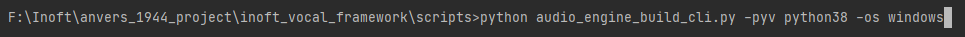
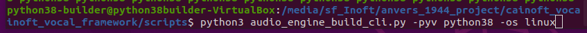

### Building

#### Navigate to the scripts folder

`cd .../inoft_vocal_framework/scripts`

#### For Windows :
Run the command `$python3-interpreter audio_engine_build_cli.py -pyv $python-version -os windows`

For example : 

#### For Linux :
Run the command `$python3-interpreter audio_engine_build_cli.py -pyv $python-version -os linux`

For example : 

---

#### Where $python-interpreter is the runnable name of your favorite Python interpreter that is of version 3.6 or higher. For example :
- python
- python3
- etc

#### Where $python-version can be :
- python39
- python38

---

The audio_engine_build_cli script will perform all 
the operations detailed in the manual build section.