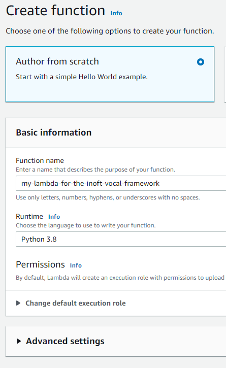
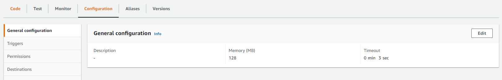
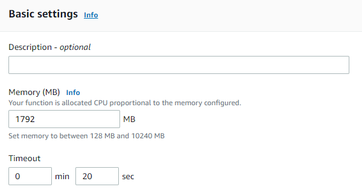
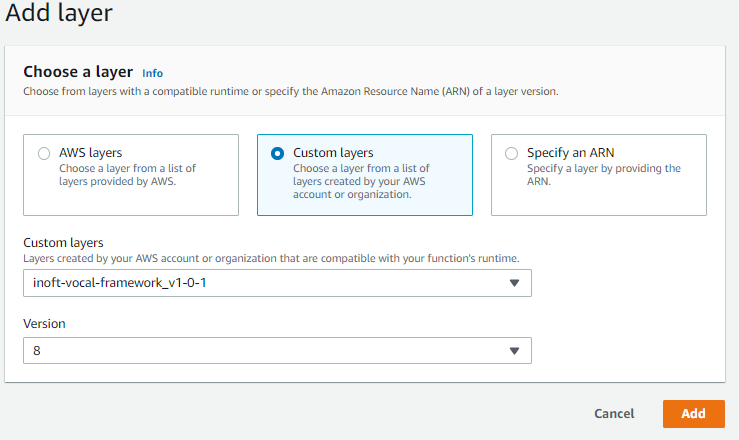
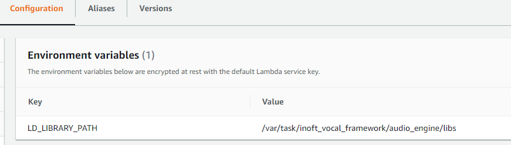
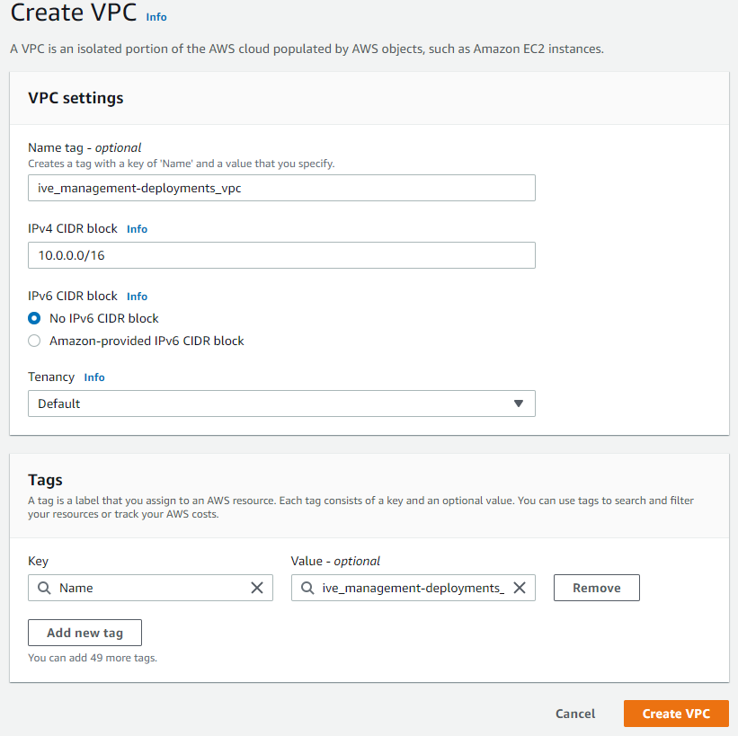
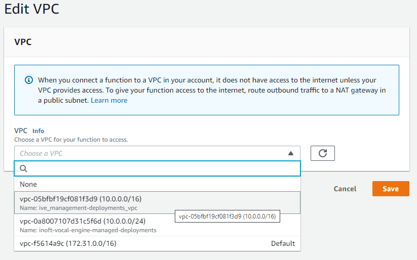
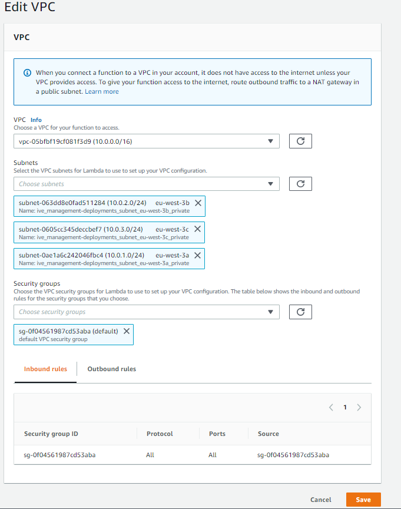
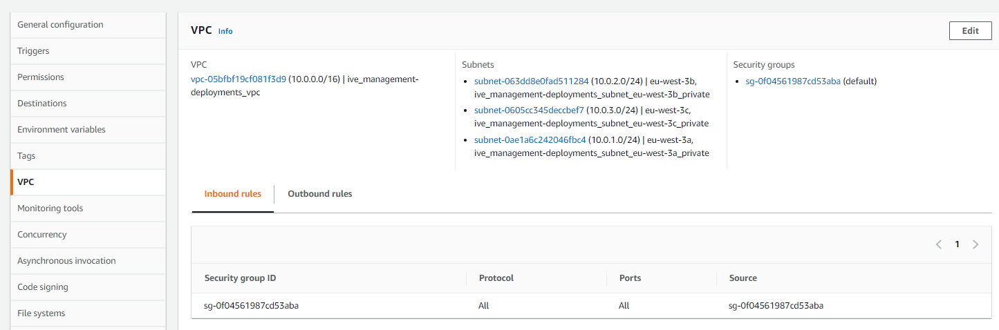
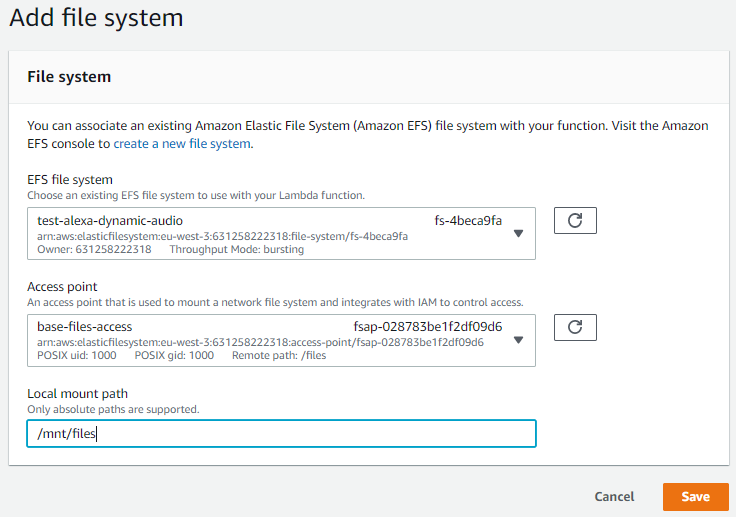

## Deploying to AWS Lambda :

### Create new Lambda function : 

Create a new lambda function, and select the latest runtime supported 
by the inoft-vocal-framework. For example, Python 3.8.

### Configuring the Lambda :

#### Go the general configuration tab, and click edit.

#### Change the memory
The more RAM you have, the more CPU power you will have. We recommend setting the RAM to 1792MB, because it is value at
which you are allocated a full vCPU. When going over 1792MB, Lambda will give you multiple vCPU in the execution of your
function. Even if going over 1792MB will slightly improve performances, the inoft_vocal_framework has been conceived to 
work on a single-thread, not as a multi-thread program that can fully exploit multiple CPUs. Since Lambda will be billed
by the memory * execution time, the tiny increase in execution time when going 1792MB is not worth it. Any increase over
1792MB of RAM will lead to diminishing returns.

#### Change the timeout
We recommend setting 20 seconds as a starting point (if an application, even in development, takes more than 20 seconds 
to execute, there is likely an issue). This number is arbitrary. If you find out that your application can be expected 
to take more than 20 seconds to execute, increase the timeout to fit your needs.

#### Add the dependencies with Lambda layer's

#### Setting up environment variables

- `LD_LIBRARY_PATH` = `/var/task/inoft_vocal_framework/audio_engine/libs` (this allow the Linux dynamic linked library to find its dependencies)

#### Adding the required permissions :

todo:
Need permissions to interact with EFS and with the VPC

#### Create a VPC (Virtual Private Network)

Go to the VPC service.
Create a new VPC.
Put any name you want.
Put 10.0.0.0/16 as the IPv4 CIDR block (you could change and have 
different numbers than 10.0.0.0, but always have a /16)
Do not use an IPv6 CIDR block.
Let the Tenancy to default (otherwise, AWS will allocate specific reserved machine for your VPC, which would slightly 
reduce latency, but will be way more expensive than the Default option)

#### Create the VPC subnets

*The subnets will be private subnets not accessible by internet*

Select the newly created VPC (if you have VPC with the same names, find your new VPC by its id)
For each availability zone in the region of your subnet (a subnet can be present in only one region, but can be duplicated
across availability zones in the same region), create a different subnet, select the matching availability zone, and for
the IPv4 CIDR block, use the value from your VPC with /24 instead of /16, but increment the second last number of the IPv4 
CIDR block for each subnet (so, in our case, our VPC uses 10.0.0.0/16, we have 3 availability zone in our region, so we
will use 10.0.1.0/24, 10.0.2.0/24 and 10.0.3.0/24).
Try to use clear name formats (for example, $subnetName_subnet_$regionAndAvailabilityZone_private)

Use /16 for the vpc, and /24 for the subnets

#### Assign the VPC to the Lambda function

#### Create a file system with EFS (Elastic File System)

Disable the automatic backups
Set the lifecycle management to 7 days
Disable encryption (we do not need it)

Do not forget to create a POSIX user

#### Assign the file system to the Lambda function

