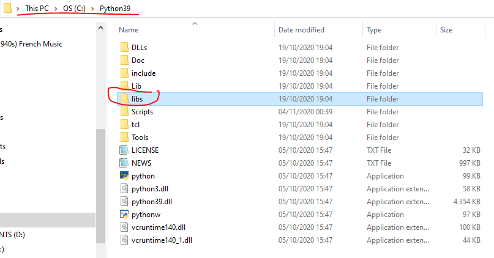
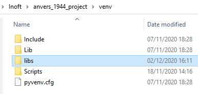
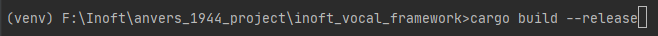

### Pre-requisites :

Make sure that the libs folder exist in the virtual environment of the project.
If its not the case, go to the installation folder of the used Python version,
copy the libs folder

_The folder should contain 'lib' files, like so for a Python 3.9 installation._

Paste the libs folder to the venv of the project used to work on the 
inoft_vocal_engine or inoft_vocal_framework. It should look like this.

---

### Building on Windows :
cd in the rust cargo project root folder, and run `cargo build --release`

Navigate into the build folder, find the .dll file of the build 
(for example 'inoft_audio_engine_rendered.dll').

 
Copy the file to the root folder of the project used to work on the 
inoft_vocal_engine or inoft_vocal_framework.

Rename the file extension of the file from .dll to .pyd
 
->

The dll will now be able to be imported as a standard python library. 

For example :

_Each time the rust code is modified, all of theses steps (new build, and 
setting up the Python module) needs to be repeated. Have fun ! :)_

